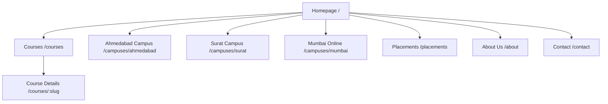

# Site Architecture & Navigation Schema (SITE-ARCHITECTURE.md)

This document details the navigation hierarchy, page routing maps, and structural linkages for the ASDM website.

## 📈 Status

- **Status**: `COMPLETE (Audited Proposed Scaffolding, Experience Decisions Logged)`
- **Last Updated**: 2026-08-01

> [!WARNING]
> Nothing in this document is approved for implementation. Routes, redirections, and architectural layouts are proposed candidates only and require stakeholder review.

---

## 🗺️ Sitemap Schema

---

## 📂 Page Route Mapping (Astro Routes)

Astro's file-system based routing map for clean redesign URLs:

| Route Path            | File Location                        | Purpose                              |
| :-------------------- | :----------------------------------- | :----------------------------------- |
| `/`                   | `src/pages/index.astro`              | Homepage (Main conversion hub)       |
| `/courses`            | `src/pages/courses/index.astro`      | Courses catalog page                 |
| `/courses/[slug]`     | `src/pages/courses/[slug].astro`     | Individual course detail page        |
| `/campuses/ahmedabad` | `src/pages/campuses/ahmedabad.astro` | Ahmedabad local landing page         |
| `/campuses/surat`     | `src/pages/campuses/surat.astro`     | Surat local landing page             |
| `/campuses/mumbai`    | `src/pages/campuses/mumbai.astro`    | Mumbai online local landing page     |
| `/placements`         | `src/pages/placements.astro`         | Placements and student outcomes page |
| `/about`              | `src/pages/about.astro`              | Team and institution history page    |
| `/contact`            | `src/pages/contact.astro`            | Contact and inquiry form hub         |
| `/homepage-preview`   | `src/pages/homepage-preview.astro`   | Internal noindex hero preview only   |

---

## 🧭 Navigation Components

- **Global Header**: Primary navigation links, dropdown courses menu, location switcher (Ahmedabad/Surat), call-to-action button ("Book Demo").
- **Global Footer**: Accreditations, sitemap footer links, address for Ahmedabad & Surat campuses, social links.

## Homepage Implementation Registry

The homepage section order is locked in `docs/homepage/HOMEPAGE-SECTION-REGISTRY.md`. The public `/` route remains the foundation page during Phase 7; `/homepage-preview` is an internal noindex route containing the approved global header, the hero section only, and the approved footer.

---

## 🔒 Competitor Visual & Navigation Guardrails (ADR-006)

- **Header/Footer Layouts**: The navigation layouts (including mega-menus and location toggles) are structured around our content schemas and must not copy competitor structures (such as IIDE's specific PG vs certification megamenu visual splits).
- **Mumbai Targeting**: Mumbai is explicitly mapped to `/campuses/mumbai` as a landing page for online courses to prevent misleading local physical traffic.
